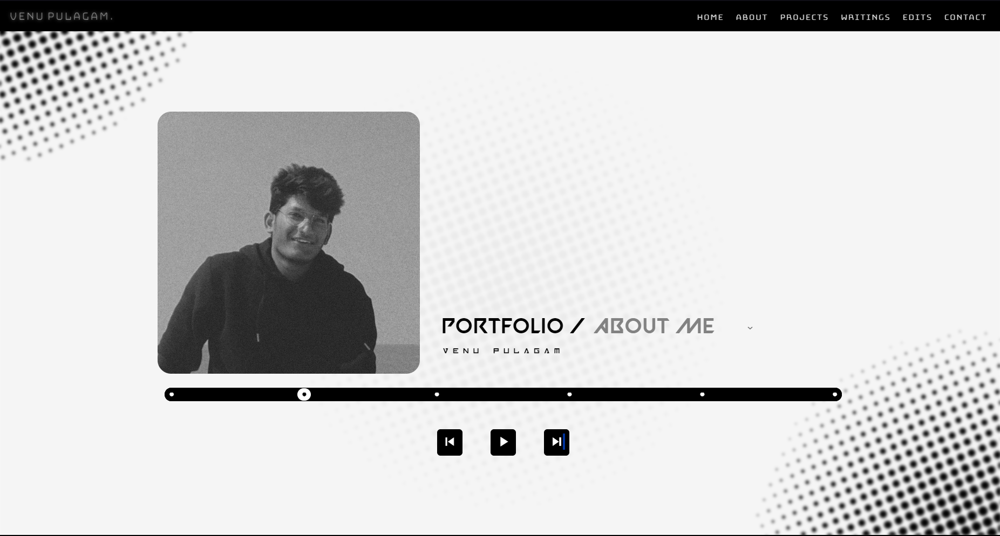
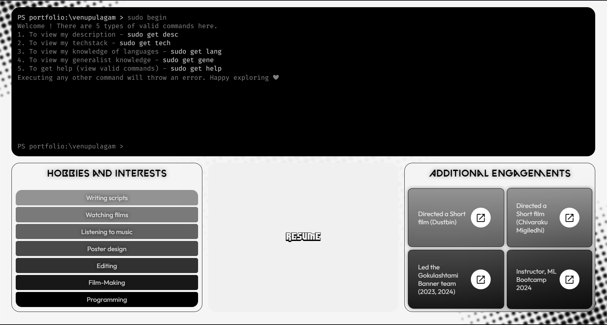
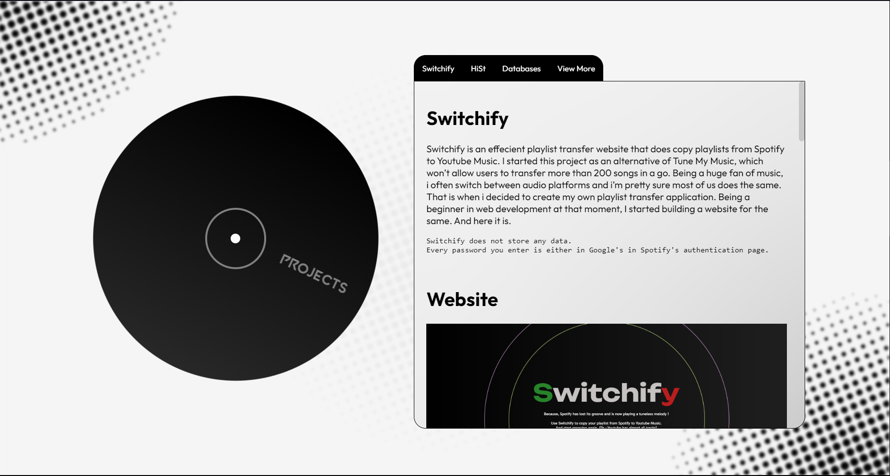
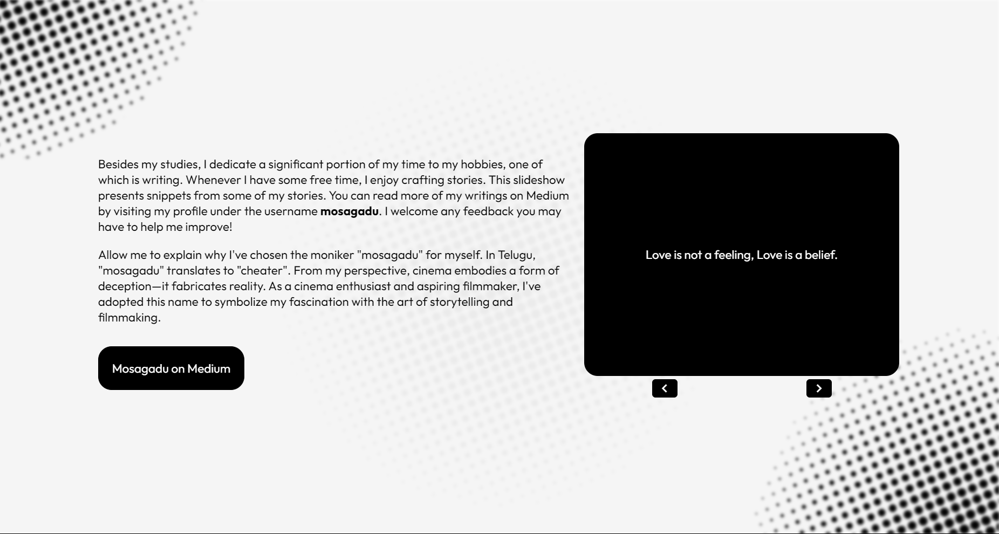
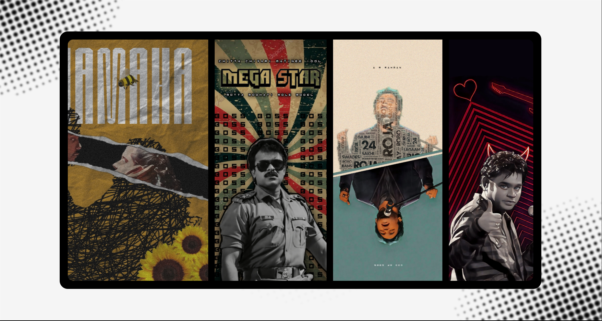
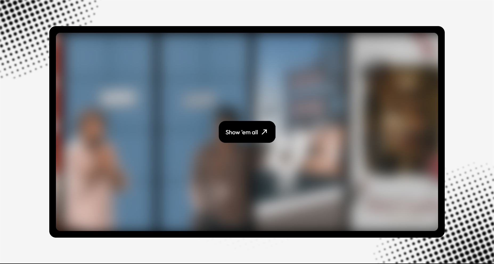

# Portfolio

Hey there, this portfolio is built purely using HTML, CSS a bit of python and Javascript. The portfolio is *built responsive* (adapting to screens), but **for a better experience, viewing from a Laptop/Computer (Landscape mode) is suggested**.
 

    Each line of code behind the website is written from scratch.

Courtesy : The message functionality used in the "Contact" page is taken from <a href=https://github.com/jamiewilson/form-to-google-sheets>here.</a>  

# Landing (Home) page

The landing page has 3 different options for navigation.

1. Click on the **previous** and **next** buttons to select the required page and hit **resume** button in the center. (The selection will appear after the **Portfolio /**)

2. Click on the white dots in the **black line (under the track line)**.
    -  The first dot takes you to **Home**. Since this is already the home page, you will be seeing a "**Already in Home**" popup above the resume button.
    - Second dot takes you to the **About** section.
    - The third one will land you in the **Projects** section.
    - 4th and 5th for **Writings** and **Edits** respectively.

3. Simply click on the buttons in the **header** section.   

# About page

The **About** section is designed to be interactive.

- The **terminal** at the top will display my Tech stack, Languages, Generalsit (non-academic) knowledge.
    - These can be accessed using simple commands as mentioned in the site.
        1. ***sudo get desc***  - Will load a brief introduction about myself.
        2. ***sudo  get tech*** - Will show you my tech stack.
        3. ***sudo get lang***  - Will display my knowledge of programming languagues.
        4. ***sudo get gene***  - Will provide you with my generalist knowledge.
        5. ***sudo get help***  - Will display all the valid commands in the terminal.
        6. ***Any other command entered will throw an error.***

- The 3 boxes under the terminal sums up my **Hobbies**, **Resume**, **Additional Engagements**. The *Hobbies* box being not interactive, the *Resume* box with a nice hover effect will take you to my resume in a new tab. The *Additional Engagements* box has 4 hyperlinks *(the arrow icons)* each doing its own job.   

# Projects page

This **About** section of the website is simple and straight forward. The ***casette*** *(rotating element on the left)* is used as a decorative item. The choice of this stylings is discussed in the [Design choices](#design-choices) section of this file. 

The tab on the right displays the most recent projects I worked on. To view all my projects, you can simply click on the *View more* button in the tabs row.   

# Writings page

With the immense love towards writing and film-making, I spend my free time writing short stories and scripts. I have uploaded all of them on <a href=https:/mdeium/@mosagadu>Medium.</a> (All stories are written in my mother tongue - Telugu)

The display box on the right features some hook lines from my writings.   

# Edits page

This section features some of my photo edits, most of them are designed for mobile screens (1080x2400)

Since these are only a few, **While you enjoy the scrolling, after 3 seconds of your cursor/hand touching this section of the page, you will see something like this.**

Clicking on the "**Show 'em all**" button will take you to the Google drive folder containing all the edits.   

# Contact page

The contact page features different ways to connect with me.

There also a way that you can directly send me a message. Whatever the content you enter in there, will get updated in the Google sheet connected with the website.

**Courtesy :** As mentioned above, the code for this particular section is taken from <a href=https://github.com/jamiewilson/form-to-google-sheets>here.</a>

    Note : For the mail option to work properly, your system should have a default app for Email services.
 

<h1 id="design-choices">Design choices</h1>

The basic idea of design of the site is quite simple. I wanted it to simple and minimalistic. So I have decided to use only 2 colors throughout. The color choice happened to be so straight forward with an idea of contrasting colors. That's why you'll predominantly see either black or white, or shades from that palette. Other colors are used sparingly, if at all.

For the design of the landing page, I wanted it to carry my persona. Since i spend a lot of time listening to music, what better describes a melophile other than Spotify (atleast in India / atleast me) ?

So the UI is heavily for the home page is heavily inspired from **Spotify**. But keeping the color choice in mind, changes were made accordingly.

To carry my personality, the **rotating casette** is added in the projects page.

The waving hand emoji in the contact page is used as a hook to make the users feel better while leaving the page. Watching a hand wave at them (in color, after 5 pages long monochrome), people may just feel good  and happy.

The choice of fonts throughout the website is the toughest part, when asked. I spent a lot of time exploring different fonts and found a few good styles. 

- Fonts used :
    - <a href="https://www.dafont.com/valorant.font">Valorant</a>
    - <a href="https://fonts.google.com/specimen/Outfit">Outfit</a>
    - <a href="https://fonts.google.com/specimen/Dela+Gothic+One">Dela Gothic One</a>
    - <a href="https://www.dafont.com/inversionz.font">Inversionz</a>
    - <a href="https://www.dafont.com/dimitri.font">Dimitri</a>

- Icons used are from:
    - <a href="https://fonts.google.com/icons">Google icons</a>
    - <a href="https://fontawesome.com/icons">Font awesome</a> 
  

# Website in portrait mode

As aforementioned, the website is made responsive. So for the displays in portrait mode, I wanted to suggest users to view the site in landscape mode. So when opened in a portrait mode display, the landing page will not be displayed on load. Instead you will see this.

</img>

Clicking on **No thanks** will take you to the home page of the website.
The rest has almost no changes unless the casette won't be displayed in portrait mode.   

# Technologies used

- HTML
- CSS
- Python
- JavaScript   

# Queries and Feedback

For any Queries and feedback please mail me at notvenupulagam@gmail.com

Hope you had a good time viewing my portfolio. Have a good day.

*Thank you.*
